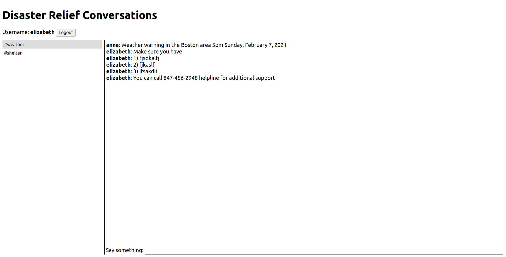

# Twilio Conversations Experimental App

[Blog article sample](https://www.twilio.com/blog/multi-room-web-chat-flask-react-twilio-conversations)

[Github repo for sample app](https://github.com/miguelgrinberg/flask-react-twilio-chat) 

### Frontend
React App with following components

- login
- chatrooms
- chatlog
- chatinput

 

### Backend
- manage chatrooms
- configure roles and permissions
- authentication
- user access

 

### Connection to our project
Can be a way to communicate between different channels, selected communication groups making information more relevant to people subscribed, flask and react app scaffolding

 

